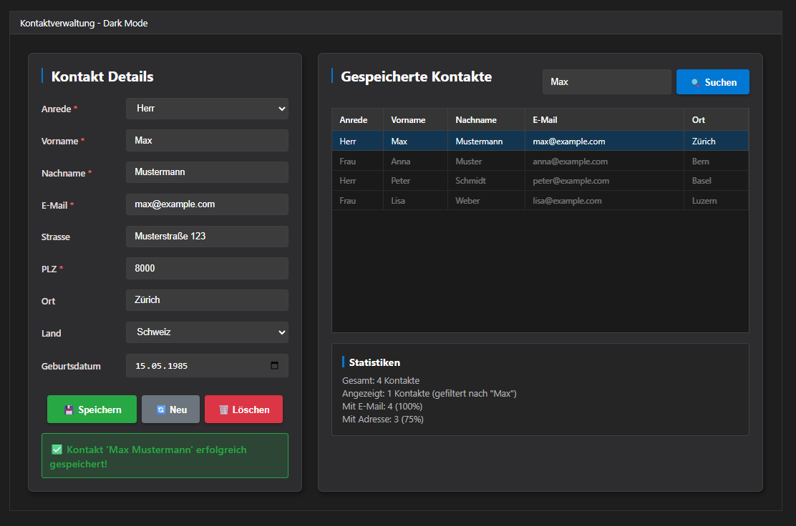

# Kontaktverwaltung (WPF, Dark Mode)

Moderne WPF-App zur Verwaltung von Kontakten mit Validierung und Suche.

> **Hinweis:** Studienprojekt (HF) – Modul **Programmieren 1**, **LB1 (Abgabe)**.

## Preview
>   

## Funktionen
- **Speichern**: Kontakt anlegen/überschreiben (Duplikatsprüfung via E-Mail).
- **Löschen**: Eingaben im Formular verwerfen (Bestätigungsdialog).
- **Suchen/Filtern**: Live-Filter auf Vorname/Nachname/E-Mail/Ort.
- **Auswahl → Formular**: Klick in der Tabelle lädt den Kontakt ins Formular.
- **Validierung**: Pflichtfelder, E-Mail-Format, PLZ-Check (4–5 Ziffern).
- **Statistiken**: Gesamt/angezeigt, mit E-Mail %, mit Adresse %.
- **Tests**: `RunValidationTests()` zeigt Ergebnis (Konsole + UI-Feedback).

## Features
- ✨ Dark UI (eigene Styles/Brushes)
- 👤 Kontakte anlegen, aktualisieren, löschen (in-Memory)
- 🔎 Suche & Filterung
- ✅ Validierung (E-Mail, PLZ, Pflichtfelder)
- 📊 Mini-Statistiken

## Tech-Stack
- .NET
- WPF
- C#

## Voraussetzungen
- .NET SDK (z. B. 8.0)
